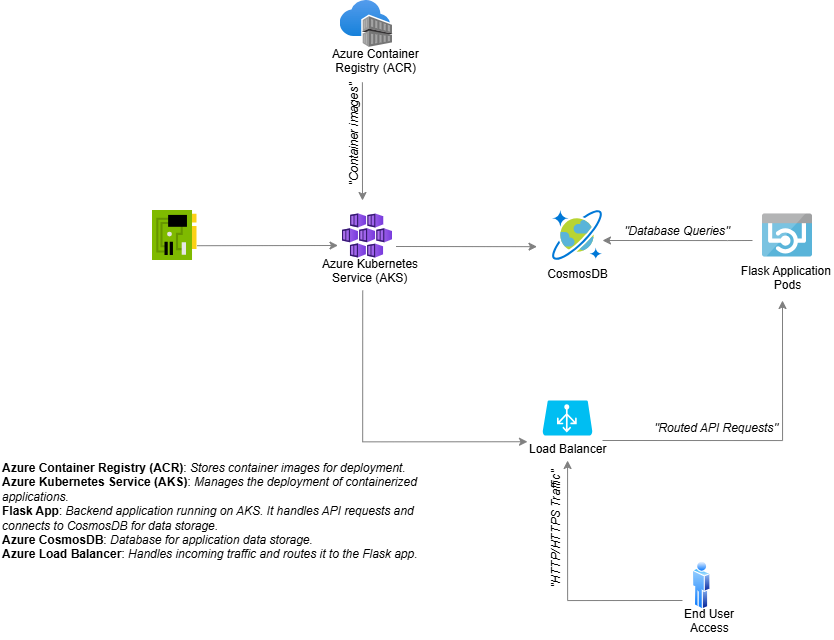
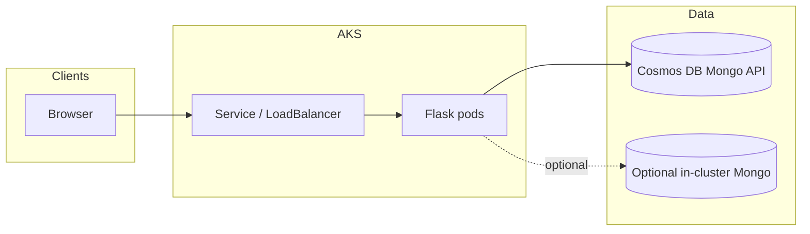

# Azure Flask Bookstore

**Cloud-native book inventory** — Flask CRUD, **Azure Cosmos DB (MongoDB API)**, **Docker** + **Gunicorn**, and **Kubernetes** manifests for **AKS** (services, persistence, network policy).

<p align="center">
  <a href="https://github.com/3bdulah/azure-flask-bookstore"></a>
  <a href="LICENSE"></a>
  
  <a href="https://github.com/3bdulah/azure-flask-bookstore/actions/workflows/ci.yml"></a>
  <a href="https://github.com/3bdulah/azure-flask-bookstore/stargazers"></a>
</p>

---

## Why this repo

| Area | What you get |
|------|----------------|
| **App** | Server-rendered Flask UI; full CRUD on books (ISBN, title, author, publisher, category, cover path, etc.). |
| **Data** | Cosmos DB Mongo API (`ain3003` database in code); optional in-cluster Mongo manifests for coursework paths. |
| **Ops** | Multi-replica `Deployment`, `Service`, `ConfigMap` / `Secret` placeholders, `NetworkPolicy`, PVC-backed Mongo. |
| **Hygiene** | No secrets in source; `.env.example`; [`SECURITY.md`](SECURITY.md); CI compiles Python on every push. |

## Table of contents

- [Quick start (local)](#quick-start-local)
- [Docker](#docker)
- [Kubernetes](#kubernetes-outline)
- [Architecture](#architecture)
- [Docs & data](#docs--data)
- [Demo video](#demo-video)
- [Contributing](#contributing)
- [Credits & license](#credits--license)

## Quick start (local)

**Prerequisites:** Python **3.12+** and a **Cosmos DB for MongoDB API** connection string (see [`.env.example`](bookstore-app/.env.example)).

```bash
git clone https://github.com/3bdulah/azure-flask-bookstore.git
cd azure-flask-bookstore/bookstore-app
python -m venv .venv
source .venv/bin/activate          # Windows: .venv\Scripts\activate
pip install -r requirements.txt
cp .env.example .env               # edit .env — never commit it
python app.py                      # http://127.0.0.1:5000
```

## Docker

```bash
cd bookstore-app
docker build -t azure-flask-bookstore:local .
docker run --rm -p 5000:5000 --env-file .env azure-flask-bookstore:local
```

## Kubernetes (outline)

1. Build and push the image to **Azure Container Registry** (or another registry).
2. Edit [`bookstore-app/YAML/deployment.yaml`](bookstore-app/YAML/deployment.yaml): replace `YOUR_ACR_NAME` with your ACR login server name.
3. Fill **private** secrets only on the cluster (do not commit real `configmap` / `secret` values). Start from the placeholders in [`YAML/configmap.yaml`](bookstore-app/YAML/configmap.yaml) and [`YAML/secrets.yaml`](bookstore-app/YAML/secrets.yaml).
4. From `bookstore-app/YAML/`:

```bash
kubectl apply -f mongodb-pvc.yaml
kubectl apply -f mongodb-deployment.yaml
kubectl apply -f mongodb-service.yaml
kubectl apply -f deployment.yaml
kubectl apply -f service.yaml
kubectl apply -f configmap.yaml
kubectl apply -f secrets.yaml
kubectl apply -f network-policy.yaml
```

Order can vary with your cluster; align with your assignment or platform docs.

## Architecture

<p align="center">
  
</p>

<details>
<summary><strong>Mermaid (same idea, text form)</strong></summary>



</details>

## Docs & data

| Path | Purpose |
|------|--------|
| [`bookstore-app/`](bookstore-app/) | Application code, templates, static assets, `Dockerfile` |
| [`bookstore-app/README.md`](bookstore-app/README.md) | Detailed Azure / ACR / AKS deployment walkthrough |
| [`BookstoreDB.txt`](BookstoreDB.txt) | Example MongoDB `insertMany` payload for seeding |
| [`CONTRIBUTING.md`](CONTRIBUTING.md) | How to suggest changes |
| [`CITATION.cff`](CITATION.cff) | Software citation metadata |
| [`SECURITY.md`](SECURITY.md) | Secret handling and reporting |

## Demo video

Upload a screen recording as an **Unlisted** YouTube (or similar) and paste the URL in the repository **About** section. Large `.mp4` files stay **out of git** (see `.gitignore`) so clones stay fast.

## Contributing

Issues and PRs are welcome. See [`CONTRIBUTING.md`](CONTRIBUTING.md).

## Credits & license

**Course:** AIN3003 · **Instructor:** Gökşin Bakır · **Author:** Abdullah Hani Abdellatif Al-Shobaki.

Licensed under the [MIT License](LICENSE).
