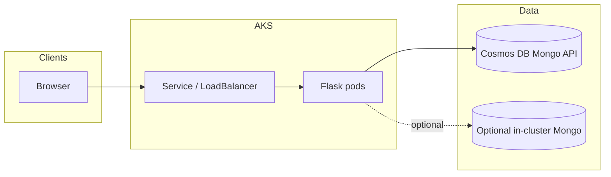

# Bookstore — Flask, MongoDB, and Kubernetes on Azure

A full-stack **book inventory** web app built for **AIN3003**: Flask CRUD UI backed by **Azure Cosmos DB (MongoDB API)**, containerized with **Docker**, and deployable to **Azure Kubernetes Service (AKS)** with manifests for services, persistence, and network policies.

[](LICENSE)
[](https://www.python.org/downloads/)
[](https://github.com/YOUR_GITHUB_USERNAME/YOUR_REPO_NAME/actions/workflows/ci.yml)

> Replace `YOUR_GITHUB_USERNAME` / `YOUR_REPO_NAME` in the badges above after you create the GitHub repository (badge URLs are plain text in the README).

## Highlights

- **CRUD** for books (ISBN, title, author, publisher, category, cover image path, etc.).
- **Cosmos DB** as the managed Mongo-compatible database (`ain3003` database in code).
- **Docker** + **Gunicorn** for production-style serving.
- **Kubernetes** YAML for MongoDB in-cluster (optional path), app `Deployment`/`Service`, `ConfigMap`, `Secret`, and `NetworkPolicy`.

## Repository layout

| Path | Purpose |
|------|--------|
| [`bookstore-app/`](bookstore-app/) | Flask application, templates, static assets, Dockerfile |
| [`bookstore-app/YAML/`](bookstore-app/YAML/) | Kubernetes manifests (edit placeholders before applying) |
| [`BookstoreDB.txt`](BookstoreDB.txt) | Example `insertMany` data for seeding MongoDB / Cosmos |
| [`SECURITY.md`](SECURITY.md) | How to handle secrets and credential rotation |

Detailed deployment notes also live in [`bookstore-app/README.md`](bookstore-app/README.md).

## Quick start (local)

**Prerequisites:** Python 3.12+, a Cosmos DB for MongoDB API connection string (or adapt the code for local Mongo only).

```bash
cd bookstore-app
python -m venv .venv
source .venv/bin/activate   # Windows: .venv\Scripts\activate
pip install -r requirements.txt
cp .env.example .env        # edit .env — never commit it
python app.py               # http://0.0.0.0:5000
```

## Docker

```bash
cd bookstore-app
docker build -t bookstore-app:local .
docker run --rm -p 5000:5000 --env-file .env bookstore-app:local
```

## Kubernetes (outline)

1. Build and push the image to your registry (e.g. Azure Container Registry).
2. In `YAML/deployment.yaml`, set `YOUR_ACR_NAME.azurecr.io` to your ACR login server name.
3. Put real connection strings in **private** secrets (not in git); replace placeholders in `configmap.yaml` / `secrets.yaml` or use your preferred secret management.
4. From `bookstore-app/YAML/`:

```bash
kubectl apply -f mongodb-pvc.yaml
kubectl apply -f mongodb-deployment.yaml
kubectl apply -f deployment.yaml
kubectl apply -f service.yaml
kubectl apply -f configmap.yaml
kubectl apply -f secrets.yaml
kubectl apply -f network-policy.yaml
```

Adjust order and resources to match your cluster (some courses use in-cluster Mongo only, others Cosmos only).

## Architecture (high level)



## Course and credits

University coursework (**AIN3003**). Instructor acknowledgment: **Gökşin Bakır**.  
Author: **Abdullah Hani Abdellatif Al-Shobaki**.

## License

[MIT](LICENSE).

## Demo video

If you have a screen recording (for example the course demo `.mp4`), upload it to **YouTube** (or similar) as **Unlisted** and add the link in the GitHub repository **About** section. Keeping large videos out of the git history keeps clones fast and avoids GitHub file-size limits.

## Suggested GitHub settings (after push)

- **About** → add website or demo link if you host one; set **Topics**, e.g. `flask`, `mongodb`, `cosmos-db`, `kubernetes`, `aks`, `azure`, `docker`, `python`, `crud`.
- Enable **Issues** if you want feedback; add a short **Description** one-liner.
- Branch protection on `main` (require PR reviews) if collaborators join later.
